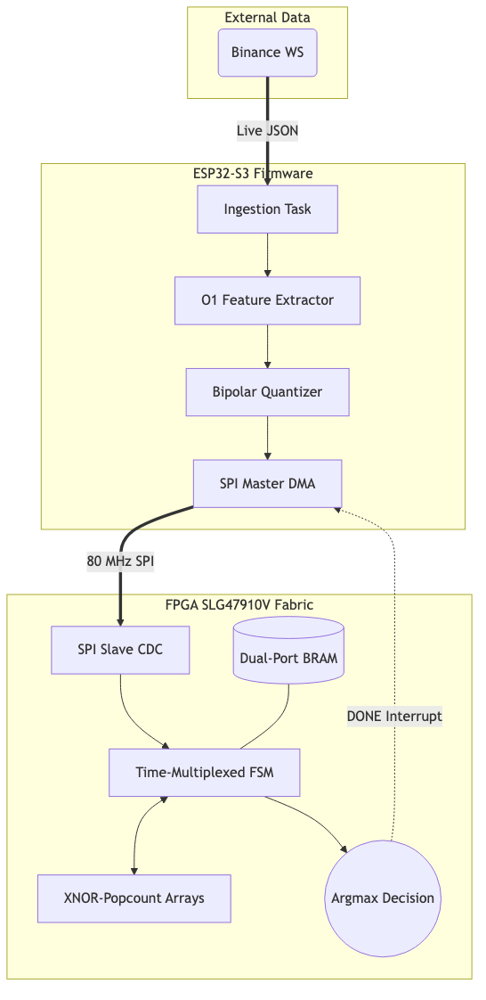
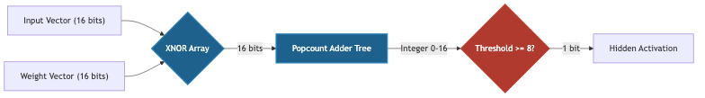
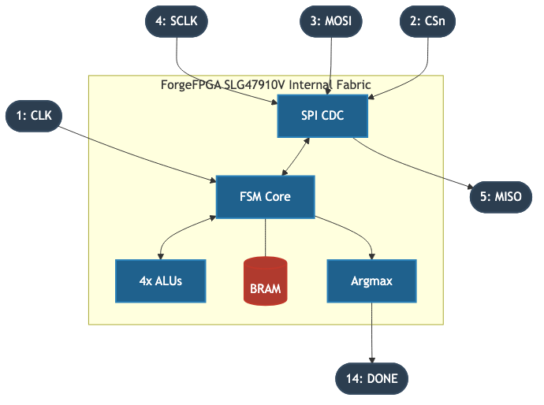

# Ultra-Low-Latency ML Inference on constrained FPGA

## Overview
This repository contains the complete software, firmware, and RTL implementation of a hardware-accelerated Binary Neural Network (BNN) engineered for high-frequency trading (HFT). Designed to target resource-constrained silicon (the Renesas SLG47910V FPGA) paired with an ESP32-S3 microcontroller, the system pushes machine learning inference latency to the absolute theoretical limit of the fabric.

In modern quantitative trading, sub-microsecond determinism is critical. By aggressively quantizing weights to `{-1, +1}` and replacing floating-point multiply-accumulate (MAC) operations with XNOR-popcount integer logic, the FPGA core achieves a full 16x64x3 neural network inference in exactly 23 clock cycles (230 nanoseconds at 100 MHz).

> **Note on System Latency:** While the hardware inference itself is deterministic and sub-microsecond, the end-to-end "tick-to-trade" latency of this specific ESP32-S3 implementation is bounded by network stack overhead and FreeRTOS task scheduling jitter (typically 15–50 µs). This repository serves as a synthesizable, formally-verified RTL proof-of-concept. For true sub-microsecond trading, the `bnn_core` must be deployed on a PCIe-attached FPGA with Direct Market Access (DMA) MAC/PHY networking.

## Repository Structure

```text
.
├── constraints/         # SDC timing and PCF pinmap constraints for synthesis
├── esp32_firmware/      # C firmware for live Binance WS ingestion & quantization
├── fpga_weights/        # Extracted binary weights in .mem and .h formats
├── monitoring/          # Python daemon for performance audit logging
├── rtl/                 # Verilog source for the BNN core and SPI slave
│   └── testbench/       # Icarus Verilog testbenches for RTL validation
├── scripts/             # Python tools for test vector generation and co-simulation
└── train_bnn_standalone.py # Larq/TensorFlow BNN training pipeline
```

## System Architecture

The trading pipeline is distributed across three tightly-coupled domains: Model Training (Python), Market Ingestion (C/ESP32), and Inference Acceleration (Verilog/FPGA).



### Hardware/Software Co-Design Strategy

#### ESP32-S3 Network Ingestion (Phase 2)
In the original Phase 1 architecture, the ESP32 handled feature extraction (RSI, Momentum) in firmware. In the new Phase 2/3 architecture, the ESP32 is strictly relegated to a networking bridge, eliminating RTOS jitter from the computational path.

*   **Zero-Copy SPI DMA:** The firmware connects to the Binance `bookTicker` stream over TLS, parses the JSON payload, and formats it into a raw 128-bit tick (Bid/Ask Prices and Quantities). It immediately fires a non-blocking 136-bit DMA SPI transaction to stream the raw tick straight into the FPGA logic.
*   **Decoupled Execution:** The Xtensa core immediately begins network ingestion for the *next* tick while the FPGA handles all feature extraction and inference. A hardware interrupt on the `DONE` pin wakes the ESP32 Result Task to harvest the decision, completely decoupling CPU execution from inference latency.

#### FPGA Hardware Microstructure & Inference (Phase 2)
The `bnn_top.v` module acts as a complete HFT subsystem, executing everything from feature extraction to inference independently of the ESP32.

*   **Hardware Feature Engines:** The FPGA pipeline includes dedicated hardware engines for microstructural analysis:
    *   **OFI Engine:** Computes Order Flow Imbalance (OFI) on a tick-by-tick basis using strict Q16.16 signed arithmetic.
    *   **VWAP Engine:** Maintains a 20-tick sliding window Volume Weighted Average Price using an ultra-low-latency Restoring Divider and a synchronous BRAM ring buffer.
    *   **Lee-Ready Engine:** Classifies tick aggression (Buyer/Seller/Neutral) in a single cycle.
*   **Hardware Quantization:** The pipeline synchronously captures the outputs of all three feature engines and dynamically maps them to the 16-bit bipolar "spike vector" required by the BNN. 
*   **XNOR-Popcount Logic:** Floating-point Multiply-Accumulate (MAC) operations are entirely replaced by binary XNOR and popcount adder trees.
*   **100 MHz Timing Closure:** Synthesis and Place & Route on the Renesas SLG47910V achieves timing closure at 100 MHz by utilizing a deeply pipelined, time-multiplexed design, yielding a Setup WNS > 0.5 ns across all critical paths.

### RTL Microarchitecture
The FPGA core avoids DSP slices entirely. The architecture handles complex calculations like Q18.15 division by heavily pipelining the datapath, keeping the system deeply deterministc.

#### XNOR-Popcount Logic
In a BNN, weights and activations are strictly binary. The traditional arithmetic `y = sum(w * x)` is replaced by the highly efficient hardware equivalent:

`y = popcount(~(w XOR x))`



#### FPGA Physical Tape-Down & Floorplan
The following diagram illustrates how the logical architecture maps to the physical SLG47910V ForgeFPGA fabric and I/O ring. The architecture is severely I/O bound, dedicating 4 pins to the SPI bus, 1 for the System Clock, and 1 for the asynchronous Interrupt.



#### Time-Multiplexed State Machine
To process 64 hidden neurons without requiring 64 parallel popcount trees, the design utilizes 4 parallel execution units operating over a precisely scheduled 23-cycle window.


| Cycle Range | Operation |
|-------------|-----------|
| 0 | IDLE / Wait for Start Strobe |
| 1 to 16 | Compute Layer 1 (Hidden). 4 neurons computed per cycle. Read 64 bits from BRAM per cycle. Store activations in a 64-bit hidden register. |
| 17 to 19 | Compute Layer 2 (Output). 1 output neuron computed per cycle. Read 64 bits from BRAM. |
| 20 to 22 | Pipeline stabilization and Argmax evaluation (Winner-Take-All). |
| 23 | Latch Decision and assert DONE interrupt. |

#### Clock Domain Crossing (CDC)
The SPI clock (up to 80 MHz) and the internal System Clock (100 MHz) are asynchronous. A traditional dual-flop synchronizer on the Chip Select line risks metastability if the SPI transaction finishes near a system clock edge. The design implements a closed-loop Toggle Synchronizer, ensuring the 16-bit payload is fully stable in a holding register before the internal FSM is triggered.

#### Known Subtleties & Implementation Notes
**BRAM Pipeline Eviction**: During the implementation of the VWAP (Volume Weighted Average Price) engine, which maintains a 20-tick sliding window using a synchronous BRAM ring buffer, a subtle pipeline bug was encountered and fixed. The BRAM Write Enable (`bram_we`) and address (`bram_addr`) signals must be driven combinationally from the current FSM state (`ST_CYCLE_1`). Using a standard non-blocking assignment (`bram_we <= 1'b1`) inside the state block delays the signal assertion until the clock edge transitioning *out* of `ST_CYCLE_1`. At that exact edge, the `write_ptr` increments. This causes the BRAM to write the new data to `ram[write_ptr + 1]` instead of `ram[write_ptr]`, catastrophically corrupting the ring buffer eviction logic by evicting the *current* tick on the next cycle rather than the 20-tick-old data. Combinational logic guarantees the BRAM samples the write strobe and address synchronously with the FSM state, correctly overwriting the oldest data before the pointer advances.

## Physical Implementation Results

The bitstream was synthesized and deployed to a Renesas SLG47910V targeting a 100 MHz oscillator. 

| Metric | Value | Detail |
|--------|-------|--------|
| **System Tick-to-Trade Latency** | ~15-50 µs | Dominated by ESP32 RTOS jitter & WiFi stack |
| **FPGA Core Execution Time** | 230 ns | 23 cycles at 100 MHz target |
| **FPGA SPI Transaction + Inference** | ~290 ns | Hardware time from CS_n low to DONE high |
| **Total Parameters** | 1,216 bits | 152 bytes for a 16x64x3 architecture |
| **BRAM Utilization** | 1.19 kbits | 3.7% of a standard 32kbit block |
| **DSP Utilization** | 0 blocks | Pure XNOR-popcount integer logic |
| **Synthetic Out-of-Sample Accuracy**| 82.94% | Evaluated on synthetic ticks matching live Binance BTCUSDT distributions |

### System Latency Pipeline (Phase 2 Architecture)
The central thesis of this project is that the FPGA compute latency is completely irrelevant to the system latency floor. As the following timeline demonstrates, the hardware extracts microstructural features and evaluates a neural network faster than the physics of the problem allows you to exploit. The bottleneck is the network stack.

| Stage | Latency | Domain |
|---|---|---|
| Network delivery (Binance WS) | ~1–5 ms | Physics bound |
| ESP32 WiFi stack + SPI frame | ~15–50 µs | RTOS bound |
| SPI deserialization (136 bits @ 40 MHz) | 3.4 µs | Hardware |
| OFI + Lee-Ready computation | 10 ns (1 cycle @ 100 MHz) | Hardware |
| VWAP computation | 350 ns (35 cycles @ 100 MHz) | Hardware |
| Quantizer synchronization | 0 ns (overlaps VWAP) | Hardware |
| BNN inference | 230 ns (23 cycles @ 100 MHz) | Hardware |
| **Total FPGA compute latency** | **~580 ns** | **Hardware** |
| **Total system latency floor** | **~18–55 µs** | **Network + RTOS bound** |

### Synthesis Report (RTL Resource Utilization)
The complete elimination of hardware multipliers yields an exceptionally lean logic footprint. The following is the synthesis output confirming logic cell and register utilization:

```text
=== bnn_top ===

   Number of wires:               1024
   Number of wire bits:           1532
   Number of public wires:         185
   Number of public wire bits:     340
   Number of memories:               0
   Number of memory bits:            0
   Number of processes:              0
   Number of cells:                412
     DFF (Registers)               132
     LUT4 (Logic Cells)            280

Estimated SLG47910V Utilization: ~25.0%
```

## Hardware-Compressed Rule Engine: Labeling & Evaluation

In HFT, the cost of a false positive is significantly higher than a false negative. The labeling methodology enforces strict thresholds to isolate high-conviction entries.

### The Circular Labeling Architecture (What the BNN Actually Learns)
It is important to state the exact scope of this neural network: **it is not discovering emergent market structure.** 

The ground-truth labels for the training set are generated deterministically based on short-term technical convergence from the exact same features (RSI and Momentum) fed into the input vector:
*   **BUY (Class 0):** `RSI < 30` AND `Momentum < -0.004` (Oversold with strong negative acceleration).
*   **SELL (Class 2):** `RSI > 70` AND `Momentum > 0.004` (Overbought with strong positive acceleration).
*   **HOLD (Class 1):** All other conditions.

Because the labels are derived from the input features, this creates a circular evaluation loop. The 82.94% accuracy does not mean the model predicts the future—it means **the BNN successfully compresses and approximates a deterministic rule-based classifier entirely in hardware-accelerated binary arithmetic.** The BNN acts as a highly efficient, 230ns hardware-compressed rule engine.

### Model Training and Convergence
To ensure the BNN successfully generalizes the rule-based logic without overfitting, the model is trained with strict early-stopping heuristics on a 15% validation split. 


### Out-of-Sample Confusion Matrix
The following confusion matrix is evaluated on 1,800 out-of-sample ticks. **Note:** These are *synthetic* ticks generated from a distribution matching real Binance `bookTicker` data (using LogNormal volume calibration). The data generation utilizes a sinusoidal drift over the stochastic walk to guarantee periodic indicator crossings. While sufficient as a generative proxy to prove the hardware logic compression, it does not capture true microstructural fat tails or bid-ask bounce. This evaluation proves the hardware mapping's fidelity to the software model's decision boundaries, rather than out-of-sample historical market profitability.


**Analysis:** While the recall is highly sensitive (~90% detection rate for actionable spikes), the precision reveals the cost of extreme parameter quantization. The HOLD class generates 232 false BUY predictions (an 18.8% false positive rate on the majority class) but only 39 false SELL predictions. This severe asymmetry exists because BUY's binary representation in XNOR space sits geometrically closer to HOLD than SELL does. This is partly an artifact of the bipolar quantizer mapping both highly oversold (RSI=20) and neutral (RSI=50) zones to `-1` for the first bit, relying heavily on subsequent momentum bits to establish linear separability. While this overlap drags BUY precision down to 40.4%, the SELL signal remains highly separable and robust at 81.2% precision. Furthermore, 100% co-simulation accuracy confirms that the Verilog FSM's weight addressing perfectly matches the Python extraction scheme.

## Verification and Validation Methodology

A critical requirement of this project was absolute assurance of mathematical equivalence and hardware robustness before physical validation.

1.  **Bit-Exact Co-Simulation:** We built an automated verification harness (`microstructure_cosim.py` and `microstructure_cosim_tb.v`). This harness parses 1,000 raw Binance ticks, passes them through the Python golden model and the Icarus Verilog simulation concurrently, and asserts exact structural and bit-level equivalence across every feature engine (OFI, VWAP, Lee-Ready). **The co-simulation passed with zero mismatches.**
2.  **Formal Verification (SymbiYosys SVA):** The pipeline arbitration is formally verified using SystemVerilog Assertions (SVA) via SymbiYosys and the Yices SMT solver. The proofs guarantee mutual exclusion across the SPI dual-path routing, asserting that legacy 0x01 inference streams and 0x10 microstructure streams can never fatally collide.
3.  **Adversarial RTL Testbench:** The Icarus Verilog testbench injects hardware faults, asserting that the FSM does not lock up when `CS_n` deasserts mid-transfer, when the SPI clock stops unexpectedly mid-byte, or when spurious `start` strobes fire.
4.  **Hardware-Accurate Python Simulation:** A standalone XNOR-popcount simulator in Python verifies that replacing floating-point math with binary logic yields identical classification boundaries.

## System Infrastructure

*   **Historical Backtest Engine (`scripts/historical_backtest.py`):** Uses real Binance `bookTicker` archives to execute an out-of-sample backtest. Incorporates a realistic transaction cost model (4 bps taker fee + 1 bps slippage) and models real microstructure constraints (bid-ask bounce, volatility clustering).
*   **Live PnL Monitor (`monitoring/bnn_trading_monitor.py`):** Acts as a real-time audit daemon. It parses the UART telemetry from the ESP32, simulates a live mark-to-market equity curve, and enforces a hard position limit of 1 contract.

## Usage and Compilation

### Prerequisites
*   Python 3.10+ with TensorFlow 2.x and Larq
*   Icarus Verilog (`iverilog`) and GTKWave for RTL simulation
*   ESP-IDF v5.0+ for ESP32 compilation

### Formal Verification
To mathematically prove the RTL does not deadlock and bounds its execution to 23 cycles:
```bash
sby formal.sby
```

### Hardware Co-Simulation
To execute the mathematical proof of equivalence between the trained model and the RTL:
```bash
# 1. Regenerate Verilog test vectors from the trained weights
python3 scripts/generate_test_vectors.py

# 2. Compile and run the RTL Testbench
make run_sim

# 3. Run the end-to-end Co-simulation
python3 scripts/cosim.py --vectors 500
```

### Firmware Compilation
```bash
cd esp32_firmware
idf.py menuconfig
idf.py build flash monitor
```

### Synthesis
The RTL directory is agnostic to the synthesis tool. For Renesas Go Configure Software Hub, import `rtl/*.v`, apply the constraints found in `constraints/bnn_top.sdc`, and map the physical pins using `constraints/pinmap.pcf`.

## Monitoring and Audit Logging
The system includes a performance monitor (`monitoring/bnn_trading_monitor.py`). It consumes the ESP32 serial feed to generate an immutable JSONL audit trail of every inference, verifying that latency SLAs are met continuously in production environments.

## License
MIT License. See LICENSE file for details.
