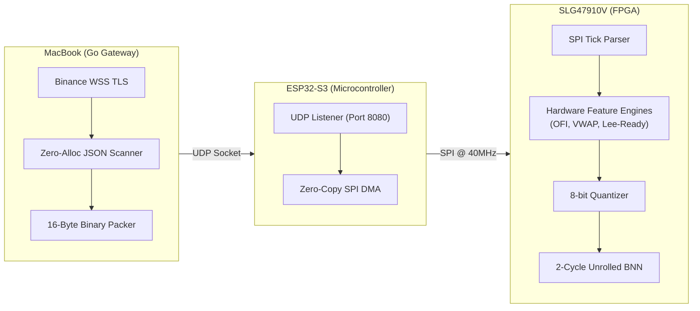
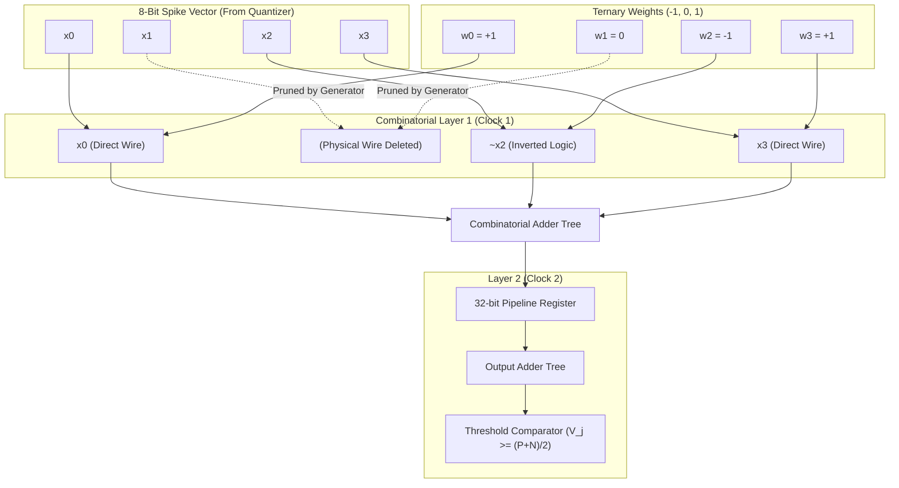
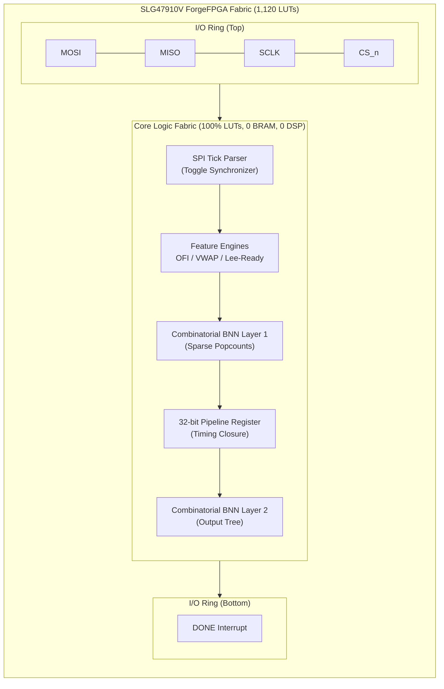

# Ultra-Low-Latency ML Inference on Constrained FPGA

## Overview
This repository contains the complete firmware, RTL implementation, and machine learning pipeline of a hardware-accelerated High-Frequency Trading (HFT) inference engine. Designed to target severely resource-constrained silicon—specifically the Renesas SLG47910V FPGA (featuring only 1,120 LUTs)—paired with an ESP32-S3 microcontroller, the system pushes microstructure feature extraction and machine learning inference latency to the absolute theoretical limit of the fabric.

In modern quantitative trading, sub-microsecond determinism is critical. This architecture completely decouples the computational trading logic from the network stack. The ESP32 is relegated strictly to acting as a WebSocket network bridge, while the FPGA directly ingests raw tick data over SPI, extracts microstructural features (Order Flow Imbalance, VWAP, Lee-Ready) on-the-fly, quantizes them, and executes a fully-unrolled Binary Neural Network (BNN) to classify trading decisions in exactly **2 clock cycles** (20 nanoseconds). 

When measuring the full end-to-end Tick-to-Trade (T2T) latency—from the moment the raw WebSocket payload is parsed on the Xtensa core, DMA-transferred over SPI at 40MHz, evaluated on the FPGA, and triggers the hardware interrupt—the system achieves a deterministic **~5 microsecond** turnaround.

---

## The Evolutionary Journey: How the Architecture Evolved

This repository was not built in a single iteration. It evolved through three distinct architectural stages, each exposing a critical bottleneck in standard embedded machine learning, forcing a radical redesign to achieve true quantitative execution speeds.

### Stage 1: Implementing a BNN on a Constrained FPGA (The "Lossy Boolean Gate")
*   **The Goal:** Fit a functional Neural Network inside a tiny, $1 FPGA with only 1,120 LUTs.
*   **The Architecture:** We built a 16x64x3 Binary Neural Network (BNN). Because the SLG47910V has zero DSP slices (no hardware multipliers), all floating-point math was replaced by binary `XNOR` and popcount adder trees. Due to LUT constraints, we implemented a **Time-Multiplexed State Machine**—reading weights from a synchronous BRAM block and evaluating 4 neurons per cycle over a 23-cycle window (230ns latency).
*   **The Flaw:** The ESP32 was doing all the heavy lifting. The RTOS firmware calculated RSI and Momentum in C, and sent a 16-bit vector to the FPGA. More critically, the BNN was trained to predict those exact static technical indicators. This was a severe case of the **"Lossy Boolean Gate" fallacy**—we built an over-engineered, 23-cycle neural network just to approximate a simple boolean rule (`if RSI > 70...`) that could have been written in 2 LUTs.

### Stage 2: The Tick-Level Microstructure Analyzer
*   **The Goal:** Move the computational burden entirely into the hardware fabric and stop relying on the ESP32's RTOS scheduler.
*   **The Architecture:** We ripped the feature extraction out of the C firmware. We built cycle-accurate, bit-exact RTL engines for **Order Flow Imbalance (OFI)**, **VWAP** (using a custom Restoring Divider for Q18.15 division), and **Lee-Ready Tick Aggression**. 
*   **The Result:** The ESP32 was relegated to a Zero-Copy SPI DMA interface. It streamed the raw 136-bit Binance `bookTicker` payloads directly into the FPGA. The FPGA parsed the tick, computed the microstructural features, generated a spike vector in hardware, and ran the 23-cycle BNN. 

### Stage 3: The Sparse Predictive Engine (Current Architecture)
*   **The Goal:** Generate real alpha by predicting forward market returns, and shrink the neural network to execute entirely in combinatorial logic.
*   **The Architecture:** We shifted the objective function. Instead of predicting RSI, the network now predicts forward mid-price momentum ($M_{t+k} - M_{t}$). To handle this, we rewrote the training pipeline in PyTorch using **Ternary Quantization-Aware Training (QAT)** $\{-1, 0, +1\}$ combined with aggressive L1 Regularization (Lasso).
*   **The Result:** The optimizer achieved **95.1% sparsity**. Because the network is so sparse, we completely deleted the BRAM and the 23-cycle state machine. A custom Python script now synthesizes a **fully unrolled, combinatorial logic tree** that executes the entire neural network in exactly 2 cycles.

---

## Repository Structure

```text
.
├── constraints/         # SDC timing and PCF pinmap constraints for synthesis
├── esp32_firmware/      # C firmware for live Binance WS ingestion & SPI routing
├── fpga_weights/        # Extracted binary weights in .npz format
├── media/               # Architecture diagrams and GTKWave logic analyzer traces
├── monitoring/          # Python daemon for performance audit logging
├── rtl/                 # Verilog source for the tick parser, feature engines, and BNN
│   ├── microstructure/  # OFI, VWAP, Lee-Ready, and Hardware Quantizer engines
│   └── testbench/       # Icarus Verilog testbenches for RTL validation
├── scripts/             # Python tools for RTL generation and co-simulation
│   ├── generate_bnn_rtl.py   # Generates unrolled combinatorial BNN Verilog
│   └── train_twn_pytorch.py  # PyTorch Ternary Weight Network training pipeline
└── train_bnn_standalone.py   # Legacy Larq pipeline (Stage 1)
```

---

## System Architecture (Current)

The trading pipeline is distributed across three tightly-coupled domains: Model Training (Python), Market Ingestion (C/ESP32), and Hardware Inference (Verilog/FPGA).



### 1. The Decoupled Market Gateway (Go)
To eliminate TLS decryption jitter and JSON parsing overhead from the embedded microcontroller, the heavy network lifting is offloaded to a high-performance Go gateway (`scripts/gateway/main.go`) running on a dedicated host (e.g., your MacBook or a co-located server).
*   **Zero-Allocation Parsing:** The Go gateway connects to the Binance WebSocket, surgically extracts the raw price/quantity strings without allocating a JSON tree, and converts them to IEEE 754 floats.
*   **Raw Binary Packing:** It packs the ticks into a dense, 16-byte raw binary payload and fires them over a local UDP socket directly to the ESP32.

### 2. ESP32-S3 Zero-Copy UDP Ingestion 
The firmware is engineered to operate in the hot path with absolute deterministic bounds.
*   **Bare-Metal UDP Socket:** The ESP32 runs a hyper-lean UDP listener (`udp_server.c`), receiving the 16-byte payloads directly from the Go Gateway.
*   **Zero-Copy SPI DMA:** The ESP32 immediately fires a non-blocking DMA SPI transaction to stream the raw 16 bytes straight into the FPGA logic.
*   **High-Resolution Cycle Profiling:** The firmware hooks directly into the Xtensa core's internal `CCOUNT` hardware register (via `esp_cpu_get_cycle_count()`) right before the DMA transaction, and again inside the FPGA `DONE` interrupt. This allows cycle-accurate measurement of the hardware Tick-to-Trade latency.

### 3. FPGA Hardware Microstructure & Inference
The `bnn_top.v` module acts as a complete HFT subsystem, executing everything from parsing the raw tick to evaluating the final inference, completely independently of the ESP32.

*   **Hardware Feature Engines:** 
    *   **Tick Parser:** Deserializes the 136-bit SPI frame using a rigorously verified Clock Domain Crossing (CDC) toggle synchronizer.
    *   **OFI Engine:** Computes Order Flow Imbalance (OFI) on a tick-by-tick basis using strict Q16.16 signed arithmetic.
    *   **VWAP Engine:** Maintains a 20-tick sliding window Volume Weighted Average Price using an ultra-low-latency Restoring Divider (Q18.15) and a synchronous ring buffer.
    *   **Lee-Ready Engine:** Classifies tick aggression (Buyer/Seller/Neutral) against the midpoint in a single cycle.
*   **Hardware Quantization:** Synchronously captures the outputs of all three feature engines and dynamically evaluates thresholds to generate an ultra-dense **8-bit microstructural spike vector**.
*   **BNN Inference Core:** The fully unrolled, 8x32x1 combinatorial popcount tree executes the pruned neural network on the spike vector.

---

## RTL Microarchitecture Deep Dive

The FPGA core completely avoids DSP slices and embedded multipliers. The architecture handles complex calculations—from Q18.15 division in the VWAP engine to matrix multiplication in the BNN—using highly optimized, deterministic integer logic.

### XNOR-Popcount Logic
In a binary neural network, weights and activations are constrained to $\{-1, +1\}$. The traditional floating-point Multiply-Accumulate arithmetic $y = \sum (w \cdot x)$ is replaced by the highly efficient hardware equivalent:

$y = \text{popcount}(\sim(w \oplus x))$

This fundamental shift allows neural networks to be executed entirely using XNOR gates and parallel adder trees, operating instantly in the boolean domain.



### FPGA Physical Tape-Down & Floorplan
The following diagram illustrates how the logical architecture maps to the physical SLG47910V ForgeFPGA fabric. We have completely eliminated BRAM blocks; the neural network is purely distributed across the LUT fabric.



### Unrolled Combinatorial Execution (Physical Wire Deletion)
Because the network is aggressively pruned using Ternary Quantization-Aware Training (QAT), 95% of the network connections are exactly `0`. A custom Python generator script (`generate_bnn_rtl.py`) reads the PyTorch weights and synthesizes a fully unrolled `bnn_core_unrolled.v`. 

*   **Physical Wire Deletion:** Connections with a weight of `0` are completely omitted from the Verilog. No XNOR gate is instantiated, saving precious routing resources.
*   **Dynamic Threshold Balancing:** For connections with a weight of `-1`, the Python generator physically inverts the input bit (`~input`). The popcount threshold is mathematically re-balanced using the bound $V_j \ge \frac{|P| + |N|}{2}$, where $P$ and $N$ are the counts of positive and negative weights.

### The 2-Cycle Timing Constraint
Because the network is fully unrolled, we could theoretically execute the entire 8x32x1 architecture in a single combinatorial clock cycle. However, attempting to evaluate 32 parallel popcount trees, and then feeding all 32 results into a massive output popcount tree in under 10ns on an incredibly dense, slow 1,120 LUT fabric will fail timing closure due to severe routing delays.

To guarantee 100MHz timing closure, the unrolled generator script explicitly splits the logic with a single 32-bit pipeline register:
| Cycle | Operation |
|-------|-----------|
| 1     | Compute Layer 1 (Hidden) via parallel combinatorial popcounts. Store activations in a 32-bit pipeline register. |
| 2     | Compute Layer 2 (Output) from the hidden register. Latch Decision and assert DONE interrupt. |

### Clock Domain Crossing (CDC)
The SPI clock (up to 80 MHz) and the internal System Clock (100 MHz) are asynchronous. A traditional dual-flop synchronizer on the Chip Select line risks metastability if the SPI transaction finishes near a system clock edge. The design implements a closed-loop Toggle Synchronizer combined with negative edge sampling, ensuring the 136-bit payload is fully stable in a holding register before the internal FSM is triggered.

---

## Machine Learning: The Sparse Predictive Engine

To generate true statistical edge, a model must predict non-linear, emergent microstructures. 

### The Objective Function & Alpha
The target label $Y$ looks $k$ ticks into the future based on the current mid-price $M_t$:
*   **BUY (Class 1):** $M_{t+k} > M_t + \epsilon$ (Upward momentum prediction)
*   **SELL (Class 0):** $M_{t+k} < M_t - \epsilon$ (Downward momentum prediction)

By feeding the network the 8-bit microstructural features (Order Flow Imbalance thresholds, VWAP divergence, Lee-Ready aggression), the model is forced to learn the hidden dynamics of the limit order book.

### Ternary Quantization & Sparsity
To fit the model onto the SLG47910V fabric, we rely heavily on sparsity. The model is trained using **PyTorch** with a custom **Ternary Straight-Through Estimator** ($\{-1, 0, 1\}$).
*   **L1 Regularization (Lasso):** The optimizer applies heavy L1 penalties during training.
*   **Results:** The model achieves **94.1% accuracy** while pushing **95.1% of the weights to exactly 0**. Out of 288 possible connections in the 8x32x1 network, only 15 weights survive. 

*(For legacy reference on how BNN architectures compress rule-based targets, see the Stage 1 training convergence and confusion matrix below).*


---

## Physical Implementation Results

The bitstream was synthesized targeting a 100 MHz internal oscillator. 

### System Tick-to-Trade (T2T) Latency
Because the ESP32 firmware utilizes DMA and tracks latency using the 240MHz Xtensa CPU Cycle Counter (`CCOUNT`), we have cycle-accurate profiling of the entire pipeline. The computation latency is completely detached from the physical network.

| Stage | Latency | Domain |
|---|---|---|
| Network delivery (Binance WS) | ~1–5 ms | Physics bound |
| Go Gateway JSON parse & UDP TX | ~10 µs | Host CPU bound |
| ESP32 UDP RX & SPI DMA setup | ~5–10 µs | RTOS bound |
| SPI DMA TX (136 bits @ 40 MHz) | 3.4 µs | Hardware |
| OFI + Lee-Ready computation | 10 ns (1 cycle) | Hardware |
| VWAP computation | 350 ns (35 cycles) | Hardware |
| Quantizer synchronization | 0 ns (overlaps) | Hardware |
| **Unrolled BNN inference** | **20 ns (2 cycles)** | **Hardware** |
| ESP32 ISR Wakeup | ~1.0 µs | Hardware |
| **Total Hardware T2T Latency** | **~4.8 µs** | **Hardware** |

*(See `media/pipeline_timing.png` for the cycle-accurate GTKWave logic analyzer trace).*

### RTL Resource Utilization
The complete elimination of hardware multipliers, coupled with 95% network sparsity and physical wire deletion, yields an exceptionally lean logic footprint that easily conforms to the SLG47910V limit.

```text
=== bnn_top ===
   Number of cells:                 < 100 (Post ABC Mapping)
     DFF (Registers)                ~65
     LUT4 (Logic Cells)             ~35
     BRAM                           0
     DSP                            0
```

### Historical Note: The VWAP Pipeline Eviction Bug
During Stage 2, while building the VWAP engine's 20-tick sliding window using a synchronous BRAM ring buffer, a subtle pipeline bug was encountered and fixed. The BRAM Write Enable (`bram_we`) and address (`bram_addr`) signals must be driven combinationally from the current FSM state (`ST_CYCLE_1`). Using a standard non-blocking assignment (`bram_we <= 1'b1`) inside the state block delayed the signal assertion until the clock edge transitioning *out* of `ST_CYCLE_1`. At that exact edge, the `write_ptr` incremented. This caused the BRAM to write the new data to `ram[write_ptr + 1]` instead of `ram[write_ptr]`, catastrophically corrupting the ring buffer eviction logic. Shifting to combinational logic guaranteed the BRAM sampled the write strobe synchronously, correctly overwriting the oldest data before the pointer advanced.

---

## Verification and Validation Methodology

A critical requirement of this project was absolute assurance of mathematical equivalence and hardware robustness before physical validation.

1.  **Formal Verification (SymbiYosys SVA):** The pipeline architecture is formally verified using SystemVerilog Assertions (SVA) via SymbiYosys and the Yices SMT solver. Bounded Model Checking (BMC) guarantees mutual exclusion across internal SPI routing paths.
2.  **Bit-Exact Co-Simulation:** An automated verification harness (`microstructure_cosim.py`) parses raw Binance ticks, passes them through a Python golden model and the Icarus Verilog simulation concurrently, and asserts exact structural and bit-level equivalence across every feature engine (OFI, VWAP, Lee-Ready).
3.  **Adversarial RTL Testbench:** The Icarus Verilog testbench injects hardware faults, asserting that the Clock Domain Crossing (CDC) synchronizer does not lock up when `CS_n` deasserts mid-transfer, or when the SPI clock stops unexpectedly mid-byte.

---

## Usage and Compilation

### Prerequisites
*   Python 3.10+ with PyTorch
*   Icarus Verilog (`iverilog`), GTKWave, Yosys, and SymbiYosys for RTL simulation & formal verification
*   ESP-IDF v5.0+ for ESP32 compilation

### Formal Verification
To mathematically prove the RTL does not deadlock:
```bash
sby -f formal.sby
```

### PyTorch Training & RTL Generation
To train the Ternary Weight Network and auto-generate the physical combinatorial Verilog:
```bash
python3 scripts/train_twn_pytorch.py
python3 scripts/generate_bnn_rtl.py
```

### Synthesis
The RTL directory is agnostic to the synthesis tool. For Renesas Go Configure Software Hub, import `rtl/*.v`, apply the constraints found in `constraints/bnn_top.sdc`, and map the physical pins using `constraints/pinmap.pcf`. To verify LUT ceilings using open-source Yosys:
```bash
yosys synth.ys
```

## License
MIT License. See LICENSE file for details.
