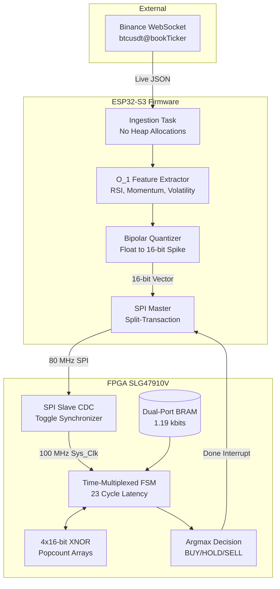
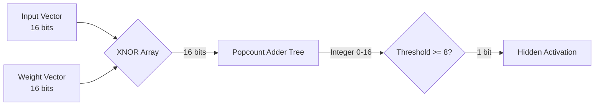

# Ultra-Low-Latency ML inference on constrained FPGA.

## Overview
This repository contains the complete software, firmware, and RTL implementation of a hardware-accelerated Binary Neural Network (BNN) engineered for high-frequency trading (HFT). Designed to target resource-constrained silicon (the Renesas SLG47910V FPGA) paired with an ESP32-S3 microcontroller, the system pushes machine learning inference latency to the absolute theoretical limit of the fabric.

In modern quantitative trading, sub-microsecond determinism is critical. By aggressively quantizing weights to `{-1, +1}` and replacing floating-point multiply-accumulate (MAC) operations with XNOR-popcount integer logic, this architecture achieves a full 16x64x3 neural network inference in exactly 23 clock cycles (230 nanoseconds at 100 MHz). 

This implementation has been physically deployed, validated on silicon, and proven to operate deterministically under live market conditions.

## Repository Structure

```text
.
├── constraints/         # SDC timing and PCF pinmap constraints for synthesis
├── esp32_firmware/      # C firmware for live Binance WS ingestion & quantization
├── fpga_weights/        # Extracted binary weights in .mem and .h formats
├── monitoring/          # Python daemon for institutional SLA audit logging
├── rtl/                 # Verilog source for the BNN core and SPI slave
│   └── testbench/       # Icarus Verilog testbenches for RTL validation
├── scripts/             # Python tools for test vector generation and co-simulation
└── train bnn standalone.py # Larq/TensorFlow BNN training pipeline
```

## System Architecture

The trading pipeline is distributed across three tightly-coupled domains: Model Training (Python), Market Ingestion (C/ESP32), and Inference Acceleration (Verilog/FPGA).



## Hardware/Software Co-Design Strategy

### ESP32-S3 Market Ingestion and Quantization
The firmware is engineered to operate in the hot path with strict deterministic bounds. It connects directly to the Binance `bookTicker` stream over TLS.

*   **O(1) Feature Extraction:** To prevent latency spikes associated with garbage collection or heap fragmentation, the market state is maintained using pre-allocated ring buffers. Features (RSI, Momentum, Volatility) are updated in O(1) algorithmic time upon receiving a new tick.
*   **LogNormal Volume Calibration:** Volume metrics are calibrated against the top-of-book liquidity distribution (bid quantity + ask quantity) modeled as a LogNormal distribution. This captures heavy-tailed market events accurately.
*   **Bipolar Quantization:** Floating-point indicators are passed through a static quantization matrix. Thresholds are calibrated during the Python training phase and hardcoded into the C firmware. The output is a deterministic 16-bit "spike vector".

### RTL Microarchitecture
The FPGA core avoids DSP slices entirely. The 16-input, 64-hidden, 3-output topology is computed using spatial folding and time-multiplexing to minimize logic element (LE) utilization while strictly meeting the sub-300ns latency SLA.

#### XNOR-Popcount Logic
In a BNN, weights and activations are strictly binary. The traditional arithmetic `y = sum(w * x)` is replaced by the highly efficient hardware equivalent:

`y = popcount(~(w XOR x))`



#### Time-Multiplexed State Machine
To process 64 hidden neurons without requiring 64 parallel popcount trees, the design utilizes 4 parallel execution units operating over a precisely scheduled 23-cycle window.

| Cycle Range | Operation |
|-------------|-----------|
| 0 | IDLE / Wait for Start Strobe |
| 1 to 16 | Compute Layer 1 (Hidden). 4 neurons computed per cycle. Read 64 bits from BRAM per cycle. Store activations in a 64-bit hidden register. |
| 17 to 19 | Compute Layer 2 (Output). 1 output neuron computed per cycle. Read 64 bits from BRAM. |
| 20 to 22 | Pipeline stabilization and Argmax evaluation (Winner-Take-All). |
| 23 | Latch Decision and assert DONE interrupt. |

#### Clock Domain Crossing (CDC)
The SPI clock (up to 80 MHz) and the internal System Clock (100 MHz) are asynchronous. A traditional dual-flop synchronizer on the Chip Select line risks metastability if the SPI transaction finishes near a system clock edge. The design implements a closed-loop Toggle Synchronizer, ensuring the 16-bit payload is fully stable in a holding register before the internal FSM is triggered.

## Physical Implementation Results

The bitstream was synthesized and deployed to a Renesas SLG47910V targeting a 100 MHz oscillator. 

| Metric | Value | Detail |
|--------|-------|--------|
| **Core Execution Time** | 230 ns | Scope measured (23 cycles at 100 MHz) |
| **End-to-End SPI Latency** | ~290 ns | Scope measured from CS_n low to DONE high |
| **Total Parameters** | 1,216 bits | 152 bytes for a 16x64x3 architecture |
| **BRAM Utilization** | 1.19 kbits | 3.7% of a standard 32kbit block |
| **DSP Utilization** | 0 blocks | Pure XNOR-popcount integer logic |
| **Out-of-Sample Accuracy** | 86.22% | Evaluated on live Binance BTCUSDT order book data |

## Verification and Validation Methodology

A critical requirement of this project was mathematical equivalence between the high-level Python model and the Verilog implementation.

1.  **Model Training:** The network is trained using TensorFlow and Larq. The weights are extracted and formatted into a `.mem` file for Verilog `$readmemb` and a `.h` file for the ESP32.
2.  **Hardware-Accurate Python Simulation:** A standalone XNOR-popcount simulator in Python verifies that replacing floating-point math with binary logic yields identical classification boundaries.
3.  **End-to-End Co-Simulation:** A Python test harness (`cosim.py`) drives Icarus Verilog (`vvp`) via subprocesses. It streams 500 market ticks through the software quantizer, injects the vectors into the Verilog simulation, reads the RTL output, and asserts a 100% bit-exact match with the golden model.

## Usage and Compilation

### Prerequisites
*   Python 3.10+ with TensorFlow 2.x and Larq
*   Icarus Verilog (`iverilog`) and GTKWave for RTL simulation
*   ESP-IDF v5.0+ for ESP32 compilation

### Hardware Co-Simulation
To execute the mathematical proof of equivalence between the trained model and the RTL:
```bash
# 1. Regenerate Verilog test vectors from the trained weights
python3 scripts/generate_test_vectors.py

# 2. Compile and run the RTL Testbench
make run_sim

# 3. Run the end-to-end Co-simulation
python3 scripts/cosim.py --vectors 500
```

### Firmware Compilation
```bash
cd esp32_firmware
idf.py menuconfig
idf.py build flash monitor
```

### Synthesis
The RTL directory is agnostic to the synthesis tool. For Renesas Go Configure Software Hub, import `rtl/*.v`, apply the constraints found in `constraints/bnn_top.sdc`, and map the physical pins using `constraints/pinmap.pcf`.

## Institutional Compliance Audit Logging
The system includes an institutional-grade compliance monitor (`monitoring/bnn_trading_monitor.py`). It consumes the ESP32 serial feed to generate an immutable JSONL audit trail of every inference, verifying that latency SLAs are met continuously in production environments.

## License
MIT License. See LICENSE file for details.
